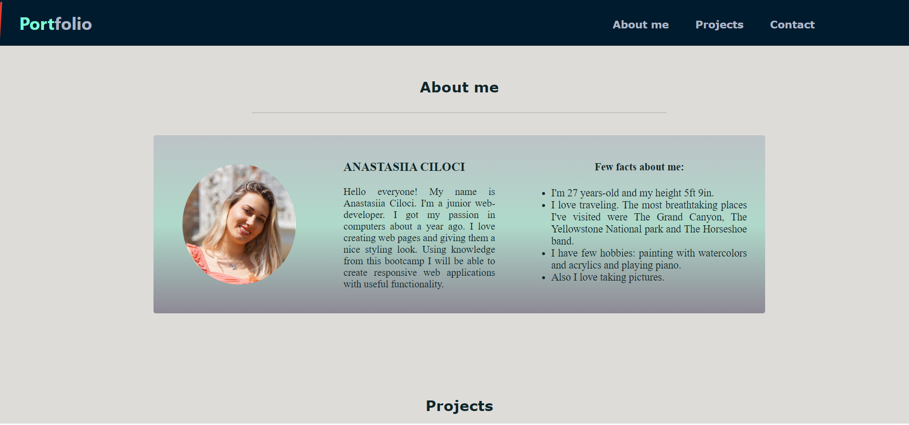
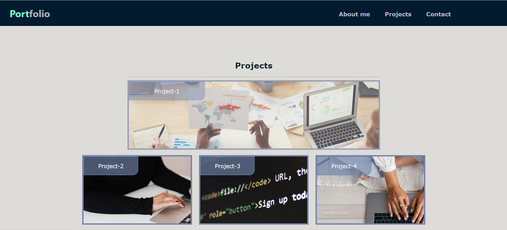

# Professional portfolio of Anastasiia Ciloci

## Table of content:

1. [Description](#description)
2. [Visuals](#visuals)
3. A [link](https://anastasiia-ciloci.github.io/Professional_portfolio/) to my portfolio

# Description

Here is the professional portfolio. The page consists of three main sections: _About me_, _Projects_and \_Contact_ It has a fixed navigation bar with hyperlinks to the sections about them.
In the _About me_ section I tell about myself, used some css properties to make a profile picture round and added gradient background on the main div.

- Using a pseudo-classes in my css I created an effect when you hover over icons at the contact section and it changes their size.

```
.contact-icon img:hover {
  height: 50px;
  background-color: #adb6c4;
  border-radius: 5px;
  transition: all 250ms ease-in-out;
  transform: translateY(-3px);
}
```

- Using media query I built a responsive layout

```
@media screen and (max-width: 1116px) {
  div main {
    display: flex;
    flex-direction: column;
    align-items: center;
  }
}

```

## Visuals






# A link to the [Professional portfolio](https://anastasiia-ciloci.github.io/Professional_portfolio/)

Or click [here](https://anastasiia-ciloci.github.io/Professional_portfolio/) to open the portfolio page.
